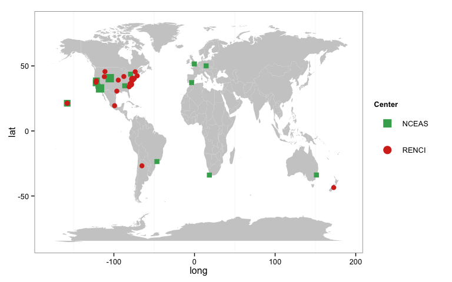

In this document we create a map of the origin of the participants of the Open Science for Synthesis 2014 hold at National Center for Ecological Analysis and Synthesis ([NCEAS](https://www.nceas.ucsb.edu/)) and University of North Carolina???s Renaissance Computing Institute ([RENCI](http://www.renci.org/)).

We created a map from the list of participants provided by NCEAS (available [here](https://www.nceas.ucsb.edu/news/open-science-synthesis-announcing-2014-program-participants)) and RENCI (available [here](http://renci.org/news/participants-from-around-the-world-to-participate-in-bicoastal-open-science-for-synthesis-course/)).

Geolocations
------------

In a first part we prepare the data and get the coordinates of the cities. To do this we used the `geocode` function of `ggmap` [package](http://cran.r-project.org/web/packages/ggmap/index.html).

``` r
# set directory 
di  <- '/Users/ajpelu/Dropbox/MS/nota_ECOSISTEMAS'

# load library
library('ggmap')
```

    ## Loading required package: ggplot2

``` r
library('ggplot2')
library('grid')

# read table 
mydata <- read.csv(paste(di,'/data/participants.csv', sep=''),header=T, sep=';')
```

``` r
# Create a name with city and Country 
mydata$location <- paste(mydata$city, mydata$country, sep=', ')

# Get coordinates from Google Maps API (see geocode function)
mydata$long <- geocode(mydata$location)[,1]
mydata$lat <- geocode(mydata$location)[,2]
```

Now we aggregate the data by city and count the number of participants by city. We hold the name of the center in which the participant attended to the course.

``` r
# Aggregate by city
mycities <- aggregate(mydata$city, by=list(mydata$city, mydata$country, mydata$lat, 
                                           mydata$long, mydata$center),
                      FUN = length)
names(mycities) <- c('city','country','lat','long','center','count')
mycities
```

    ##               city        country    lat      long center count
    ## 1         Honolulu            USA  21.31 -157.8583  NCEAS     2
    ## 2         Berkeley            USA  37.87 -122.2727  NCEAS     1
    ## 3         Stanford            USA  37.42 -122.1661  NCEAS     1
    ## 4       Santa Cruz            USA  36.97 -122.0308  NCEAS     2
    ## 5            Davis            USA  38.54 -121.7405  NCEAS     2
    ## 6    Santa Barbara            USA  34.42 -119.6982  NCEAS     1
    ## 7        San Diego            USA  32.72 -117.1611  NCEAS     3
    ## 8     Fort Collins            USA  40.59 -105.0844  NCEAS     3
    ## 9       Huntsville            USA  34.73  -86.5861  NCEAS     1
    ## 10         Toronto         Canada  43.65  -79.3832  NCEAS     1
    ## 11       Sao Paulo         Brazil -23.55  -46.6333  NCEAS     1
    ## 12         Granada          Spain  37.18   -3.5986  NCEAS     1
    ## 13          London             UK  51.51   -0.1278  NCEAS     1
    ## 14          Prague Czech Republic  50.08   14.4378  NCEAS     1
    ## 15       Cape Town   South Africa -33.92   18.4241  NCEAS     1
    ## 16          Sydney      Australia -33.87  151.2070  NCEAS     1
    ## 17        Honolulu            USA  21.31 -157.8583  RENCI     1
    ## 18           Manoa            USA  21.32 -157.8033  RENCI     1
    ## 19        Stanford            USA  37.42 -122.1661  RENCI     1
    ## 20           Davis            USA  38.54 -121.7405  RENCI     1
    ## 21           Logan            USA  41.74 -111.8338  RENCI     1
    ## 22         Bozeman            USA  45.68 -111.0472  RENCI     1
    ## 23     Mexico City         Mexico  19.43  -99.1332  RENCI     1
    ## 24 College Station            USA  30.63  -96.3344  RENCI     1
    ## 25     Kansas City            USA  39.10  -94.5786  RENCI     1
    ## 26         Chicago            USA  41.88  -87.6298  RENCI     1
    ## 27        Columbia            USA  34.00  -81.0348  RENCI     1
    ## 28     Chapel Hill            USA  35.91  -79.0558  RENCI     2
    ## 29          Durham            USA  35.99  -78.8986  RENCI     1
    ## 30         Raleigh            USA  35.78  -78.6382  RENCI     1
    ## 31         Hanover            USA  39.80  -76.9830  RENCI     2
    ## 32        Priceton            USA  40.36  -74.6672  RENCI     1
    ## 33        Montreal         Canada  45.51  -73.5540  RENCI     1
    ## 34          Boston            USA  42.36  -71.0598  RENCI     1
    ## 35         Tucuman      Argentina -26.81  -65.2176  RENCI     1
    ## 36    Christchurch   New Zealand  -43.53  172.6362  RENCI     1

Plot the map
------------

``` r
# colour world map 
micolor <- 'gray80'
color.nceas <- '#41ab5d'
color.renci <- '#d7301f'

# Get a world map
wm <- map_data('world')

p <- ggplot() + geom_polygon(data=wm, aes(x=long, y=lat, group=group), fill=micolor)
p1 <- p + geom_point(data=mycities,aes(x=long, y=lat, size=factor(count), shape=center, color=center)) + 
  scale_shape_manual(name='Center', values=c(15,16))+ 
  scale_size_manual(values=c(3,4,5), guide=FALSE)+ 
  scale_colour_manual(name='Center', values=c(color.nceas,color.renci))+
  theme_bw() + theme(panel.grid.major=element_blank(), 
                     panel.grid.minor.y = element_blank(),
                     legend.key.size = unit(1.2, "cm"),
                     legend.key=element_blank())+
  guides(colour = guide_legend(override.aes = list(size=5))) # To increase the size of points in legend

# Render the map
p1
```


